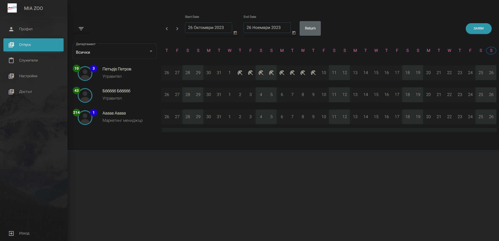

## LOCAL INSTALLATION


<h3>WSL2</h3>

	1. $ git clone https://github.com/georgirtodorov/hr-app.git
	2. $ cp .env.example .env /to execute Docker file (build .) in the main project directory /
        .env file should contain PASSPORT_PERSONAL_ACCESS_CLIENT_ID and PASSPORT_PERSONAL_ACCESS_CLIENT_SECRET
        for Persional Access Token (https://laravel.com/docs/10.x/passport#creating-a-personal-access-client)
        Example inside .env file:
        ```
        PASSPORT_PERSONAL_ACCESS_CLIENT_ID=1
        PASSPORT_PERSONAL_ACCESS_CLIENT_SECRET=utDL7u6QukeVNiAUd4kgOreK1QsDFbjpOSle9zum
        ```
	3. $ cp docker-compose.local.example.yml docker-compose.yml /change ports of APP/DB/MYADMIN if needed to avoid conflicts/
	4. $ docker-compose build && docker-compose up -d
	/it will run docker-compose.yml with nginx setup , it's config is located in nginx/default.conf /
	5. Install Laravel dependencies
		a. $ docker exec -it hr-app_laravel_1 bash  // (or whatever your container is named , one way to check is with 'docker-compose up -d')
		b. $ composer i
		Go back to Ubuntu ( ctrl + d )
	6. Add permissions so docker can write in folders
		a. $ sudo chown -R $USER:$USER vendor
		b. $ chmod -R 777 vendor resources storage

        Run below command from the hr-app/app/Console directory:
        c. $sudo chown -R georgi:georgi Commands/
	7. Install Laravel Passports (you were needed storage write permissions first , from the prev step)
		a. $ docker exec -it {your_container_name} bash
		b. $ php artisan passport:keys
		Go back to Ubuntu ( ctrl + d )
	8. $ docker-compose down && docker-compose build && docker-compose up -d
	9. Install angular packages
		a. $ cd resources/frontend/angular2
		b. npm install --force (if fails , try clean cache and retry: $ npm cache clear --force )
    10. Run angular: 
        - $ ng serve
    
    #start backend:  $ docker-compose up -d
    #start frontend: $ cd resources/frontend/angular2 
                     $ ng serve 

    web: localhost:4200
    pma: localhost:8080
    
