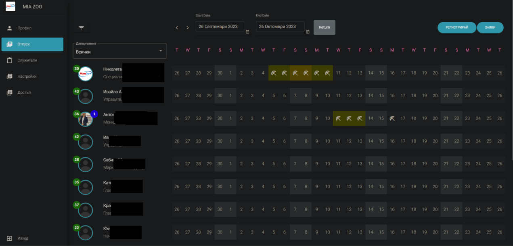
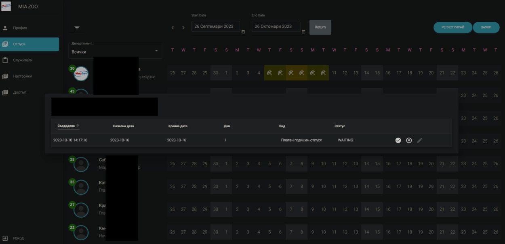

***
***
# #APPLICATION FOR EMPLOYEE MANAGEMENT AND LEAVE REQUESTS
***
***

1. [APP OVERVIEW](#app-overview)
    - [PROJECT DESCRIPTION](#project-description)
    - [TECHNOLOGY STACK](#technology-sack)
    - [FEATURES](#features)
    - [PROJECT STATUS](#project-status)
2. [LOCAL INSTALLATION](#local-installation)
    - [WSL2](#wsl2)
3. [RUN LOCALLY](#run-locally)
4. [USED TECHNOLOGIES](#used-technologies)
5. [APP FEATURES](#app-features)
6. [STOP AND DELETE APP](#stop-and-delete-app)

***
***
## APP OVERVIEW

<h3>PROJECT DESCRIPTION</h3>

An ongoing project that aims to assist businesses in efficiently managing and tracking various types of absence requests. The project centers around a desktop web application designed for leave management, utilizing technologies such as Laravel, Angular, Docker, MySql, and Apache.

<h3>Technology Stack</h3>

**Laravel**
   - Laravel-passports
   - Laravel-permissions
   - Middlewares
   - Cron
**Angular**
   - Guards
   - Interceptors
   - Pipes
   - Custom directive for permissions
**MySQL**
   - One-to-one and One-to-many relations
**Docker**

<h3>FEATURES</h3>

**LOGIN**
   - Protected with guard
   - Reset password functionality

**REQUESTS**
   - Show number of remaining days per employee
   - Show number of pending requests per employee if any
   - List in calendar
   - Filter
   - Register for someone else if you have the needed rights
   - Register for yourself
   - List is loaded based on your position
   - After register or approve/decline data is populated in the calendar without refreshing
   - Notification on request registered/approved/declined



- Pending request count or clicking on request from the calendar opens the request.



**PROFILE**
   - Profile data
   - Picture
   - Change password
   - Requests tracking

**EMPLOYEES**
   - Create/edit employees

**SETTINGS**
   - Notifications settings.
   - Requests settings (types, holidays, remaining days estimation logic)

**ACCESS**
   - Control permissions,roles,etc..

<h3>PROJECT STATUS</h3>
The project is currently in its early stages and is not yet ready for public presentation.


***
***
## LOCAL INSTALLATION

<h3>WSL2</h3>

1. **Clone the repository:**
```bash
git clone https://github.com/georgirtodorov/hr-app-review.git
```

2. **Prepare .env and docker-compose.yml:**

```bash
cd hr-app-review
cp .env.example .env
cp docker-compose.local.example.yml docker-compose.yml
```
OPTIONAL: Configure email SMTP credentials, needed for app notifications. You can use free services like https://mailtrap.io
```bash
vim .env
#find and replace below
MAIL_HOST={your_email_host}
MAIL_PORT={sending_email_port}
MAIL_USERNAME={inbox_username}
MAIL_PASSWORD={inbox_password}
#save and exit: ESC + :wq 
```

3. **Build and run docker:**
```bash
docker-compose build && docker-compose up -d
```

4. **Install Laravel dependencies inside the app container:**
```bash
docker exec -it hr-app-review_laravel_1 bash
composer i
#Back to Ubuntu, press `Ctrl + D`.
```
5. **Add permissions so docker can write in folders:**
```bash
sudo chown -R $USER:$USER vendor
chmod -R 777 vendor resources storage app/Console/Commands
```

6. **Install Laravel Passports:**
```bash
docker exec -it hr-app-review_laravel_1 bash
php artisan passport:keys
#Back to Ubuntu, press `Ctrl + D`.
```

7. **Rebuild the docker**
```bash
docker-compose down && docker-compose build && docker-compose up -d
```

8. **Delete cached data and rebuild**
    - Sometimes cached data can prevent app to connect properly to the database, of your browser can trigger CORS policy errors.
```bash
docker exec -it hr-app-review_laravel_1 bash
composer dump-autoload
php artisan clear-compiled
php artisan config:clear
php artisan cache:clear
#Back to Ubuntu, press `Ctrl + D`.
docker-compose down && docker-compose build && docker-compose up -d
```

9. **IMPORTANT Manually add initial database data**
- Go to pma: [localhost:8080](http://localhost:8080)
- log with: username: **user** password: **user**
- Import the Database data
- Option 1: **Import file **database/db_for_dev_purposes.sql** inside 'laravel' table from PHPMyAdmin.
- Option 2:
```bash
#Copy everything from db_for_dev_purposes.sql
cat database/db_for_dev_purposes.sql
```
Run SQL query/queries on database 'laravel' from PHPMyAdmin using the copied data from 'database/db_for_dev_purposes.sql'

10. **Install angular dependencies**
```bash
cd resources/frontend/angular2
npm install --force
#(npm install --force fails , try clean cache and retry: npm cache clear --force. Unfortunately we need --force, because project was started with some angular template which I don't have time to fix, despite that template is used only in the side menu) 
```

11. **Run angular on locally**
```bash
ng serve 
```
Login at [localhost:4200/login](http://localhost:4200/login)
Email: **testmail@gmail.com**
Password: **testtest**
***
***

## RUN LOCALLY
1. **Start docker**
```bash
docker-compose up -d 
```

2. **Start angular**
```bash
cd resources/frontend/angular2 
ng serve
```

3. **Locations**
    - web: [localhost:4200/login](http://localhost:4200/login)
      (email: **testmail@gmail.com** | password: **testtest**)
    - pma: [localhost:8080](http://localhost:8080)
      (user: **user** | password: **user**)


4. **Local build**
```bash
cd resources/frontend/angular2 
ng build --configuration local --base-href "/" --deploy-url=/assets/angular/ && cp ../../../public/assets/angular/index.html ../../views/angular.blade.php
```

***
***
## STOP AND DELETE APP
1. Stop docker
```bash
docker-compose up -d
```
2. Deleting app
   If you no longer need this repo locally, delete your database volumes.
```bash
#run 'docker volume ls' to get existing volumes
docker volume rm hr-app-review_sailmysqldb
```
***
***
